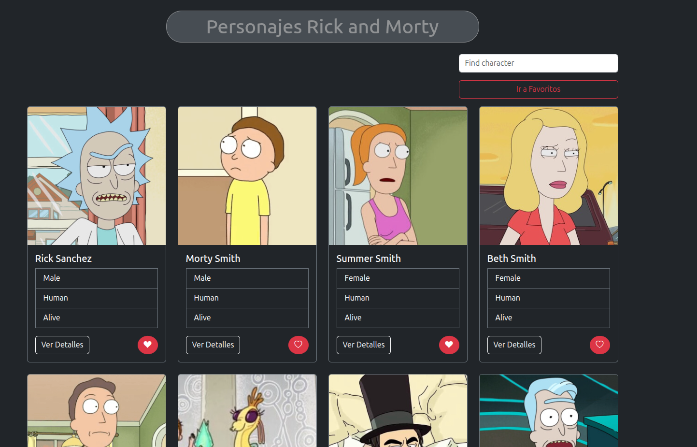

# Rick and Morty Favorites

✨ **Descripción**  
Rick and Morty Favorites es una aplicación construida con React que permite explorar personajes de la serie animada *Rick and Morty* mediante su API oficial.  

La app ofrece una experiencia sencilla e interactiva para:  
- Navegar y visualizar una lista de personajes.  
- Ver detalles específicos de cada personaje.  
- Marcar y gestionar personajes favoritos.  
- Consultar la lista de favoritos en una sección dedicada.

Para manejar el estado global de favoritos, se utiliza Context API, y la navegación entre páginas se realiza con React Router DOM. Además, la app consume datos de la API usando axios.

---

## Estructura principal

- **Componentes:** para mostrar la lista, detalles, tarjetas individuales y favoritos.  
- **Contexto:** para mantener y actualizar la lista global de favoritos.  
- **Rutas:** configuradas para facilitar la navegación entre listado, detalles y favoritos.

---

## Tecnologías usadas

- React  
- React Router DOM  
- Context API  
- Axios  
- Vite (para la configuración y construcción del proyecto)  

---

## Cómo usarlo

1. Clona el repositorio y ejecuta la instalación de dependencias.  
2. Corre la aplicación localmente para explorar personajes y administrar favoritos.  

---

## Captura de pantalla

---

¡Disfruta explorando el universo de Rick and Morty con esta app React! 🚀🛸  
